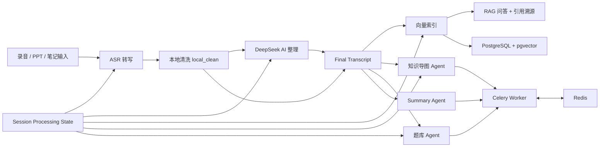

# Notero

面向中文课堂的 AI 学习工作台：把课堂录音、PPT、随堂笔记整理成可搜索、可追溯、可复习的智能学习助手。

Notero 不是一个简单的“AI 总结器”。它更关注真实课堂里的完整链路：录音转写、PPT 对齐、AI 语义整理、本地兜底、RAG 引用溯源、知识导图、题库生成和长任务状态恢复。

当前项目同时提供 Web 课堂工作台与 Pad 课件批注界面，共用同一套后端数据、任务状态和学习资料生成链路。

## Demo

### 演示视频

[▶ 点击观看 Notero 功能演示](./docs/assets/demo.mp4)

> 视频展示课堂录音转写、AI 整理及学习资料生成等核心流程。

### 产品截图

<p align="center">
  
</p>

<p align="center">
  
  
</p>

### RAG 引用溯源

<p align="center">
  
</p>

## Features

- 录音转写：支持实时录音和上传录音文件，基于 FunASR / DashScope 进行语音识别。
- 三层转写兜底：保存 `raw_text -> local_clean -> ai_corrected`，DeepSeek 不可用时也能保留本地整理稿。
- PPT 处理与对齐：上传 PPT 后提取页面内容，辅助把课件插入到对应课堂文本附近。
- RAG 引用溯源：基于本地向量索引回答问题，并展示转写、PPT、笔记来源卡片。
- 知识导图：从最终课堂稿生成复习用知识地图，支持节点详情和来源查看。
- 题库与测验：自动生成题库，测验优先覆盖错题和未做题。
- 多 Agent 自动化：转写完成后自动建立索引，并生成 summary、mindmap、quiz bank。
- 统一状态机：将转写、AI 整理、索引、导图、题库等长任务状态落库，刷新后可恢复。
- Pad 课件批注：支持逐页画笔、橡皮擦、撤销/重做和标注持久化。
- 多轮课堂问答：保留课次问答历史，支持来源定位与上下文压缩。
- 分享与导出：支持课次分享、导出和基础权限控制。

## Architecture



## Tech Stack

- Frontend: React 18, TypeScript, Vite, Tailwind CSS, React Flow, ELK
- Backend: FastAPI, SQLAlchemy, Alembic, PostgreSQL, pgvector
- AI: DeepSeek OpenAI-compatible API, DashScope embedding / ASR fallback
- Audio: FunASR, FunASR streaming model, FFmpeg
- Async Tasks: Celery, Redis
- Search: PostgreSQL/pgvector with neural embedding fallback
- Tests: Pytest, Vitest, GitHub Actions

## Requirements

- Node.js 20+
- Python 3.10+ or 3.11+
- PostgreSQL 15+
- Redis 6+
- FFmpeg
- Optional but recommended: CUDA / GPU for faster local ASR

FunASR models are not stored in this repository. The first run may download models from ModelScope, which can take several minutes depending on your network.

## Quick Start

### 1. Install frontend dependencies

```bash
npm install
```

### 2. Install backend dependencies

```bash
cd backend
pip install -r requirements.txt
```

### 3. Configure environment

Copy the example file and fill in your own values:

```bash
cp .env.example .env
```

Required:

```env
DATABASE_URL=postgresql://postgres:<password>@localhost:5432/notero
SECRET_KEY=change-this-to-a-long-random-string
```

Recommended AI keys:

```env
DEEPSEEK_API_KEY=your-deepseek-key
DASHSCOPE_API_KEY=your-dashscope-key
QWEN_VL_API_KEY=your-qwen-vl-key
```

### 4. Prepare PostgreSQL

Create the database if it does not exist:

```sql
CREATE DATABASE notero;
```

The backend runs Alembic migrations on startup.

### 5. Run backend

```bash
cd backend
uvicorn app.main:app --reload --reload-dir app --reload-exclude tests --host 0.0.0.0 --port 8003
```

### 6. Run frontend

```bash
npm run dev
```

Open the Vite URL shown in the terminal, usually `http://localhost:5173`.

### Mac frontend + Windows backend

If the backend runs on Windows and the frontend runs on macOS, keep the backend
paths and generated media on Windows. On the Windows machine, start FastAPI on a
LAN-accessible host:

```powershell
cd backend
uvicorn app.main:app --reload --reload-dir app --reload-exclude tests --host 0.0.0.0 --port 8003
```

On the Mac, create `.env.local` and point Vite at the Windows backend:

```env
VITE_API_PROXY_TARGET=http://<windows-lan-ip>:8003
```

Then run:

```bash
npm run dev
```

With `VITE_API_PROXY_TARGET`, the browser calls the Mac Vite server first, and
Vite proxies `/api` and `/ws` to Windows. This is recommended for local
development because HTTP requests and ASR WebSocket traffic share the same
frontend origin. If you instead use direct browser requests to Windows, set
`VITE_API_BASE_URL=http://<windows-lan-ip>:8003` and make sure the backend
`ALLOWED_ORIGINS` includes the frontend origin, such as `http://localhost:5173`
or `http://<mac-lan-ip>:5173`.

## Docker

Docker Compose includes PostgreSQL, Redis, the backend service and Celery workers. Copy `.env.example` to `.env`, adjust AI keys, then run:

```bash
docker-compose up --build
```

The backend will be available at `http://localhost:8000`.

For frontend local development, `npm run dev` is still recommended.

## Testing

Frontend:

```bash
npm run build
npm run test
```

Backend tests require PostgreSQL. Use a separate database whose name contains `test`:

```bash
set TEST_DATABASE_URL=postgresql://postgres:<password>@localhost:5432/notero_test
py -3.10 -m pytest backend/tests/test_rag.py backend/tests/test_vector.py -q
```

On macOS/Linux:

```bash
export TEST_DATABASE_URL=postgresql://postgres:<password>@localhost:5432/notero_test
python -m pytest backend/tests/test_rag.py backend/tests/test_vector.py -q
```

## Open Source Notes

This repository does not include:

- `.env` files or API keys
- PostgreSQL data
- uploaded audio / PPT files
- generated slide images
- FunASR model cache
- coverage artifacts

Each developer should configure their own PostgreSQL database, AI API keys, and local ASR environment.

## Project Highlights

如果你是从简历或项目展示页点进来的，可以重点看这些工程点：

- 设计三层转写稿保存模型，避免 AI 不可用时回退到 raw ASR。
- 构建统一课次处理状态机，管理转写、索引、导图、题库等长任务状态。
- 实现课堂 RAG 问答，支持转写/PPT/笔记多源检索与引用溯源。
- 使用 Agent pipeline 与 Celery 并行生成 summary、mindmap、quiz bank，并通过 Redis 协调任务状态。
- 基于 PostgreSQL/pgvector 构建课堂资料检索，结合 `content_hash` 实现索引与学习资料失效检测。
- 将 PostgreSQL、Alembic、Redis、Docker、CI 接入完整开发流程。

## Roadmap

- 完善 Pad 手写笔压感与音频时间轴联动
- 更细粒度的音频时间戳与段落溯源
- RAG 多轮对话记忆
- 错题间隔重复复习
- 更完善的模型 provider 切换

## Contributing

欢迎提交 Issue 和 PR！请参阅 [CONTRIBUTING.md](./CONTRIBUTING.md) 了解开发环境搭建、代码规范和提交流程。
